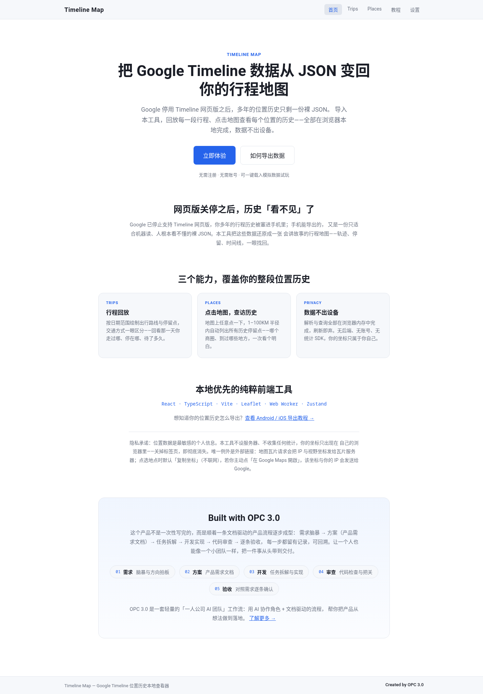
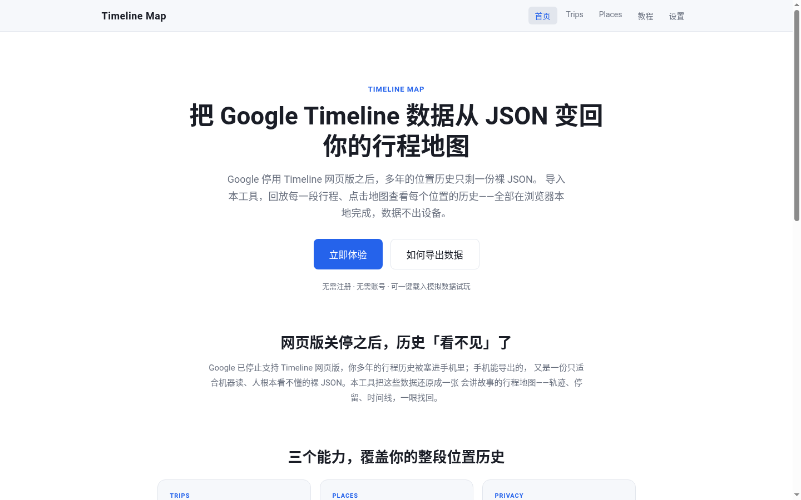
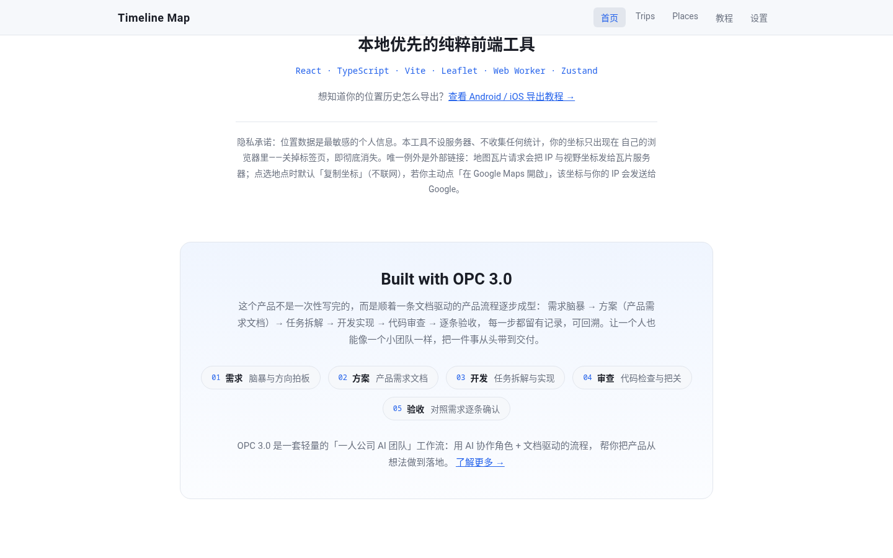
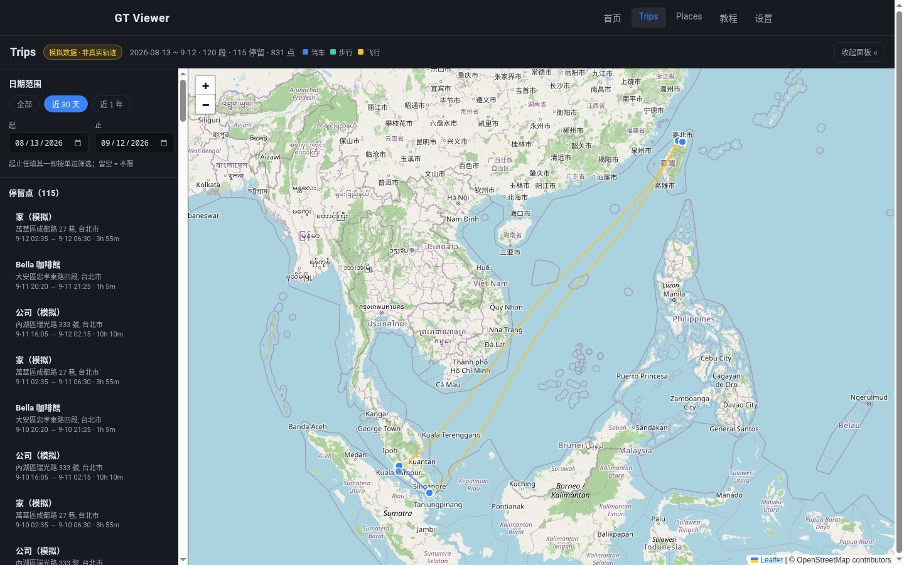
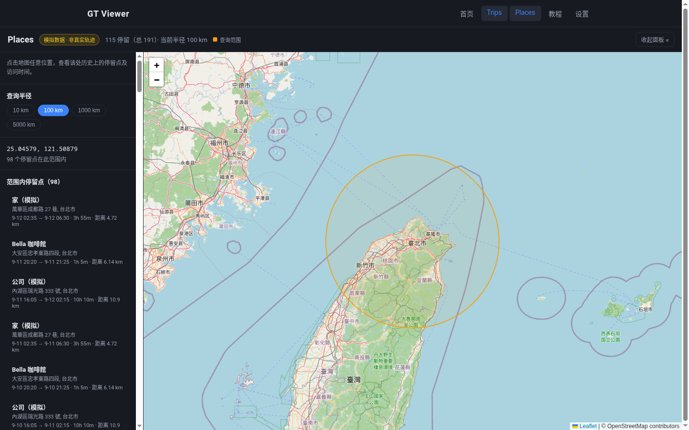
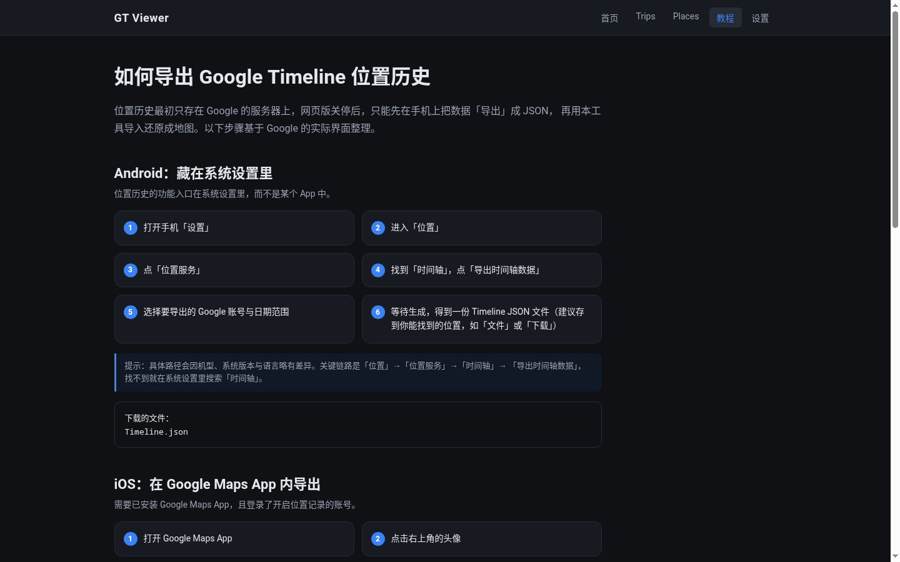
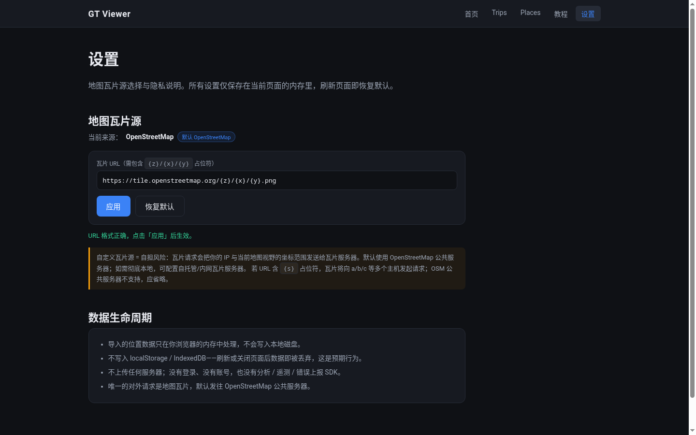

# GT Viewer

> Google Timeline 位置历史本地查看器

<!-- badges: npm / CI / license — 部署后替换占位符 -->
[](#)
[](#)
[](#)

---

## 功能亮点

- **Trips — 行程回放**：按日期范围绘制出行路线，交通方式一眼区分；停留点自动标注时长，轨迹与停留联动。
- **Places — 点击查历史**：地图任意位置一点，10 / 100 / 1000 / 5000 KM 四档半径内自动列出所有历史停留点，半径圆可视化，自动缩放至圆完整可见。
- **四种格式一键导入**：支持 Timeline.json（设备直导）、Records.json（Takeout）、YYYY\_MM.json（语义位置历史按月）、Location History.json（旧版 Takeout）——拖拽或选择文件即用。
- **隐私优先**：全程纯浏览器运行，数据只在内存中处理，刷新即弃，无后端、无账号、无统计 SDK。你的坐标只属于你自己。

---

## 截图

### Landing 首页





### Built with OPC 3.0 section



### Trips 视图（行程回放）



### Places 视图（点击查访）



### 导出教程页



### 设置页



---

## 快速开始

### 本地运行

```bash
git clone https://github.com/<user>/google-timeline-viewer.git
cd google-timeline-viewer
npm install
npm run dev
```

浏览器访问 `http://localhost:5173`，点击「立即体验」可一键载入模拟数据试玩。

### 在线 Demo

🔗 **https://\<user\>.github.io/google-timeline-viewer/**

<!-- 部署后替换为真实链接 -->

---

## 如何获取你的 Timeline 数据

位置历史目前只存在于 Google 的服务器上，需要先在手机上导出 JSON 文件，再导入本工具。

**Android**（藏在系统设置里）：

设置 → 位置 → 位置服务 → 时间轴 → 导出时间轴数据

**iOS**（在 Google Maps App 内）：

Google Maps 头像 → 设置 → 个人内容 / 位置和隐私 → 导出时间轴数据

> 不同机型或系统版本，入口名称可能略有差异。找不到可在设置里搜索「时间轴」。

详见应用内「教程」页，含完整步骤、格式说明与 FAQ。

---

## 支持的格式与文件结构

本工具自动识别以下四种导出格式，多文件可一次性合并导入：

| 文件名 | 来源 | 结构特征 |
|--------|------|----------|
| `Timeline.json` | 手机系统设置 / Maps App 直导（新版） | 顶层数组，含 `semanticSegments` / `rawSignals` |
| `Records.json` | Google Takeout | `locations[]` + `activitySegments[]` |
| `YYYY_MM.json` | Takeout Semantic Location History（按月） | `timelineObjects[]`（`placeVisit` / `activitySegment`） |
| `Location History.json` | Takeout（旧版） | `locations[]`（仅原始坐标） |

如有多份文件（按月导出、不同时段），可全选后一次性导入，工具会自动合并。

---

## 隐私声明

**位置数据是最敏感的个人信息。本工具的设计原则是：你的坐标永远不出你的设备。**

- **全部在浏览器内存中处理**——不写入 `localStorage`、不写入 `IndexedDB`、不缓存到磁盘。
- **刷新页面即清空**，关闭标签页数据彻底消失，这是预期行为。
- **无后端、无登录、无账号**——没有任何服务器在等待接收你的数据。
- **无任何统计 / 遥测 / 错误上报 SDK**——应用代码不会偷偷联网。
- **地图瓦片**：默认请求 OpenStreetMap 公共服务器的瓦片图片，此请求会暴露你的 IP 地址和当前地图视野的坐标范围。设置页可切换为自托管或内网瓦片服务器，彻底消除外部请求。

---

## 技术栈与架构

### 技术栈

React 19 · TypeScript · Vite 8 · Leaflet + react-leaflet · Zustand · react-router-dom · Web Worker

### 架构简介

```
┌─────────────────────────────────────────────────────┐
│  浏览器 UI（React）                                   │
│  ┌───────────┐  ┌───────────┐  ┌──────────────────┐ │
│  │ Trips     │  │ Places    │  │ Settings / Help  │ │
│  └─────┬─────┘  └─────┬─────┘  └──────────────────┘ │
│        │               │                              │
│        └─────┬─────────┘                              │
│              ▼                                        │
│     ┌────────────────┐     ┌─────────────────────┐   │
│     │ Zustand Store   │◄────│ Parse Worker        │   │
│     │ (in-memory)     │     │ (Web Worker)        │   │
│     └───────┬─────────┘     │ - 四格式自动识别    │   │
│             │               │ - 多文件合并         │   │
│             │               └─────────────────────┘   │
│             ▼                                         │
│     ┌────────────────┐     ┌─────────────────────┐   │
│     │ Leaflet Map    │     │ SpatialGrid          │   │
│     │ (tiles: OSM)   │     │ (1°×1° bbox+haversine│   │
│     └────────────────┘     └─────────────────────┘   │
└─────────────────────────────────────────────────────┘
```

- **解析层（Web Worker）**：JSON 解析与格式识别在 Worker 线程中执行，不阻塞 UI；文件超 100MB 时提前提示。
- **空间索引（SpatialGrid）**：1°×1° 均匀网格 + haversine 大圆距离精确过滤，支持 10–5000KM 范围查询，37000+ 停留点查询响应在毫秒级。
- **状态管理（Zustand）**：导入数据、示例数据加载、日期范围、瓦片源等全局状态均为纯内存存储，刷新即清空。

---

## Built with OPC 3.0

这个产品不是一次性写完的，而是顺着一条文档驱动的产品流程逐步成型：

1. **需求**脑暴与方向拍板
2. **方案**——产品需求文档（PRD）
3. **开发**——任务拆解与实现
4. **审查**——代码检查与把关
5. **验收**——对照需求逐条确认

每一步都留有记录，可回溯。让一个人也能像一个小团队一样，把一件事从头带到交付。

[OPC 3.0](https://github.com/opencode/opc-3.0) 是一套轻量的「一人公司 AI 团队」工作流——用 AI 协作角色 + 文档驱动的流程，帮你把产品从想法做到落地。

---

## 许可证

本项目采用 [MIT License](#) 发布。详见仓库中的 LICENSE 文件。
